:toc:

## Welcome to "docker-debug-1"

This is a small example project with the goal to demonstrate how to debug inside a docker container. It includes a small sample docker project and instructions to debug.

## Project setup

### Clone this repository

Use command to clone this repo.

```bash
git clone https://github.com/BorodaUA/git_actions_test.git
```

### Pre-install requirements

- Install https://www.docker.com/[docker]
- Install https://docs.docker.com/compose/install/[docker compose]

For docker compose on Mac, it is currently installed with the Docker Desktop, but may not be linked. If you get an error in docker compose from the `make up` command below, run:

```bash
mkdir -p /usr/local/lib/docker
ln -s /Applications/Docker.app/Contents/Resources/cli-plugins /usr/local/lib/docker/cli-plugins
```
See: https://github.com/docker/for-mac/issues/6569#issuecomment-1312244210

- Install https://code.visualstudio.com/download[VSCode IDE]
- Install https://marketplace.visualstudio.com/items?itemName=ms-azuretools.vscode-docker&ssr=false#review-details[Docker extension]
- Install remote extensions:
* https://marketplace.visualstudio.com/items?itemName=ms-vscode-remote.remote-ssh
* https://marketplace.visualstudio.com/items?itemName=ms-vscode.remote-explorer
* https://marketplace.visualstudio.com/items?itemName=ms-vscode-remote.vscode-remote-extensionpack
* https://marketplace.visualstudio.com/items?itemName=ms-vscode-remote.remote-ssh-edit
* https://marketplace.visualstudio.com/items?itemName=ms-vscode-remote.remote-containers

## Setup `.env` file

### Semi-automatic `.env` file set-up

Use the `env_setup` command make command to set up the local `.env` file.

```bash
make env_setup
```

NOTE: If you don't have `make` in your system you can follow a https://www.geeksforgeeks.org/how-to-install-make-on-ubuntu/[guide] how to install it, or use manual setup.

### Manual `.env` file setup

If you don't use the 'semi-automated' set-up above, you can manually create an `.env` file in the root folder of the repository and copy the content of the `.env.example` file.

## Run the project docker compose

### Run the project docker compose with make commands

* Use make to build and run the project's docker compose
```bash
make up
```

* Use make to restart project's docker compose
```bash
make restart
```

* Use make to stop project's docker compose
```bash
make stop
```

* Use make  to stop and remove containers of the project's docker compose
```bash
make down
```

### Run the project docker compose with manual commands

Navigate to the repository root folder and use following commands:

* Use docker command to build and run project's docker compose

```bash
docker compose up -d
```

* Use docker command to stop and remove containers of the project's docker compose
```bash
docker compose down
```

## Connect to the running container

With a running Docker container or Docker compose, open the Docker extension (a little whale on the left side of VSCode), right click on the container you want to connect into and select 'Attach Visual Studio Code'

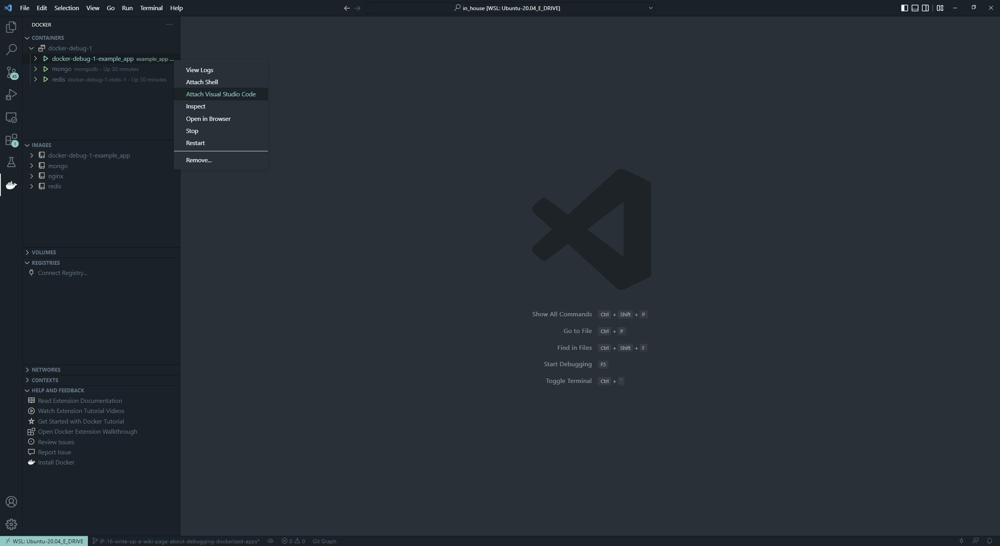

If the Docker extension is not visible in your left menu bar, you may need to show it by clicking on the three horizontal dots and selecting "Docker" from the list.

An additional pop-up window in the top middle of the screen might pop up with a list of containers to select. In our case select the `/example_app` container.

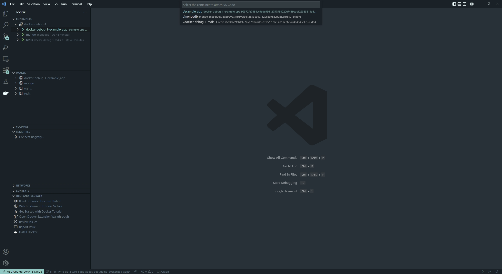

A new window will show up and after a short wait you will be connected to the container.

## vscode dev container configuration setup

Once you are connected inside the container press `F1`, `CMD+SHIFT+P` (Mac). or the equivalent for your system, and start typing: `open container conf` and select "open container configuration file"

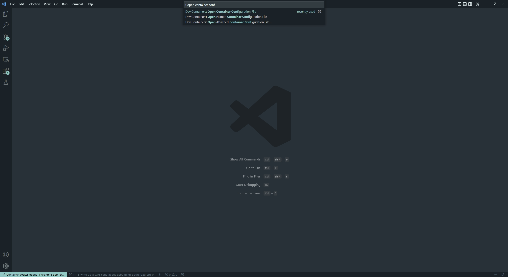

You will open an empty `.json` file

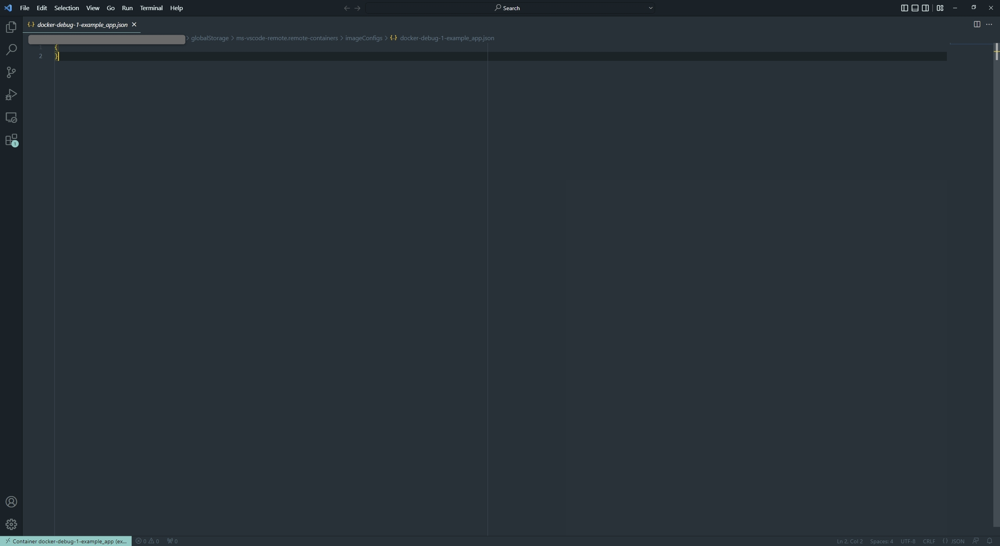

Edit that file with the following proposed configuration:

```json
{
    "workspaceFolder": "/usr/src/app", 
    "extensions": [
		"donjayamanne.githistory",
		"hbenl.vscode-test-explorer",
		"ms-python.python",
		"ms-python.vscode-pylance",
		"ms-toolsai.jupyter",
		"ms-toolsai.jupyter-keymap",
		"ms-toolsai.jupyter-renderers",
		"ms-vscode.test-adapter-converter"
	]
}
```

Here we add the VSCode extensions that will be installed when connecting to the container as well as `"workspaceFolder": "/usr/src/app"` the default folder what will be opened. Save the file manually if needed and close it.

In the next step we need to restart our docker compose using `make restart` or manual commands to make sure that the changes above will take effect.

## Create a debug configuration .json file (Python examples)

Open the Run and debug section in VSCode (the 'play' button on the left, with a bug on it) and click create a launch.json file button.

A prompt window with supported configs will pop up. Select 'install extensions' and install the python extension "ms-python.python" extension (including Intellisense and other debugging tools) inside the container. It may be necessary to `make restart` again before trying to use the Python debugging tools below. 

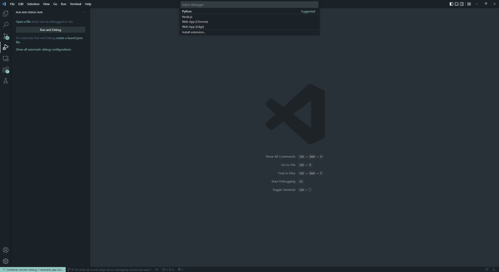

Select Python then any configuration like "Python File".

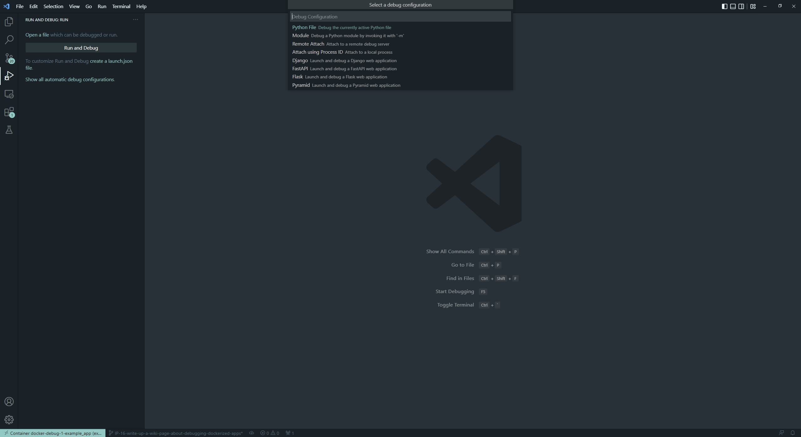

After that, a json file with configurations will open up. This will create `.vscode` folder in the root of your `pwd` directory(in our case `/usr/src/app`).

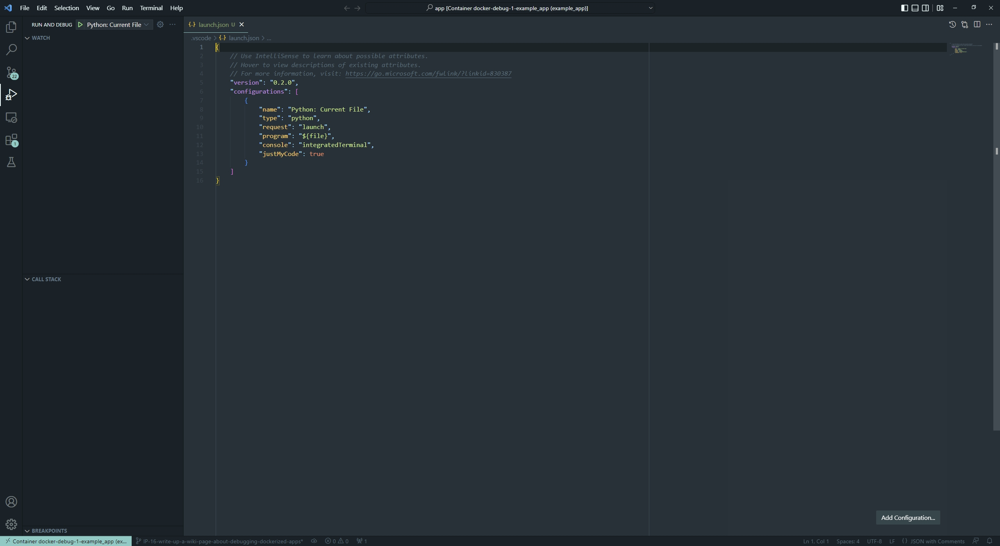

Here you have created your debug configuration and it is working in the file that you currently have open in VSCode.

## Add new configurations in the debug `launch.json` file.

* 1 Configuration with specific script name

```json
{
	"name": "python debug_example_1.py",
	"type": "python",
	"request": "launch",
	"program": "/usr/src/app/debug_example_1.py",
	"console": "integratedTerminal",
	"args": [],
	"justMyCode": true
}
```

This is an example of a configuration for a specific .py file
Debug configuration equivalent to CLI command: `python /usr/src/app/debug_example_1.py`

* 2 Configuration with a specific script name and CLI arguments

```json
{
	"name": "python debug_example_cli_1.py --name=John --age=25",
	"type": "python",
	"request": "launch",
	"program": "/usr/src/app/debug_example_cli_1.py",
	"console": "integratedTerminal",
	"args": [
		"--name=John",
		"--age=25"
	],
	"justMyCode": true
}
```

This is an example of configuration to specific .py file that accepts CLI arguments.
Debug configuration equivalent to CLI command: `python /usr/src/app/debug_example_cli_1.py --name=bob --age=28`

This is how `.vscode/launch.json` looks with all the debug configs above.

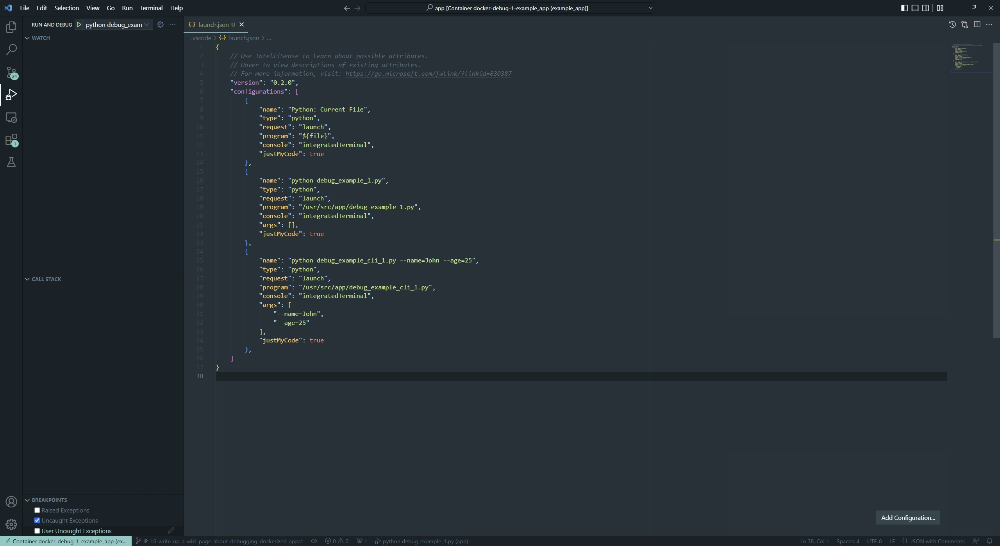

You can put as many configurations as you want; "configurations": [] is just a list with json configurations.

After the configurations are set up, you will be able to run the configuration and place breakpoints to investigate and debug the code.

## Debug configuration usage examples

Go to the 'Run and Debug' section in vscode and select debug configuration you want to use.

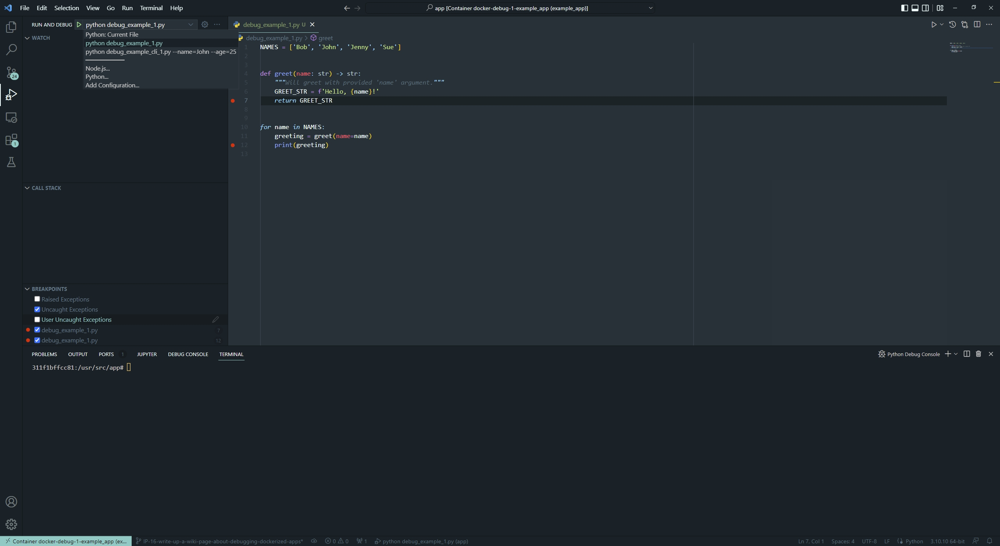

### Usage example for a specific `.py` file.

Select the `python debug_example_1.py` configuration and open the `debug_example_1.py` file, then place break points, for example within the `greet()` function. After that, run the configuration by pressing `F5`, (or the equivalent button for your system Mac, Linux etc.) or the green triangle button next to `python` in the top left.

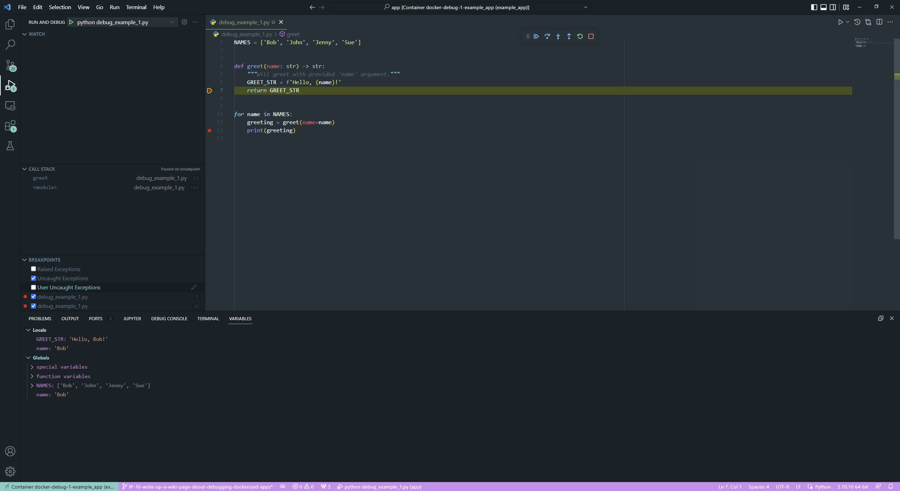

The break points should work and the execution of the code will be suspended. Select the `variables` tab in your terminal where you can expand `locals` and `globals` menus to see all the variables.

Control execution with https://code.visualstudio.com/docs/editor/debugging#_debug-actions[Keys] to traverse through the code.


### Usage example for a specific `.py` file that takes CLI arguments.

Select `python debug_example_cli_1.py --name=John --age=25` configuration and open `debug_example_cli_1.py` file, then place break points, for example in the `greet_cli()` function. After that, run the configuration by pressing `F5`(or equivalent button for your system mac,linux etc.) or green triangle button.

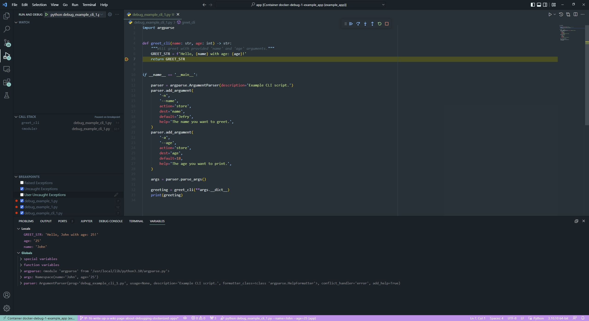

The break points should work and the execution of the code will be suspended. Select the `variables` tab in your terminal where you can expand `locals` and `globals` menus to see all the variables.

Control execution with https://code.visualstudio.com/docs/editor/debugging#_debug-actions[Keys] to traverse through the code.

You can change variables that you pass to the script by editing the debug config.


## Closing notes

Debug in docker containers with VSCode requires a little bit of manual set-up, but the advantages are very big. I highly recommend reading the https://code.visualstudio.com/docs/editor/debugging[official] documentation for the VSCode debugging setup. Happy bug hunting!
